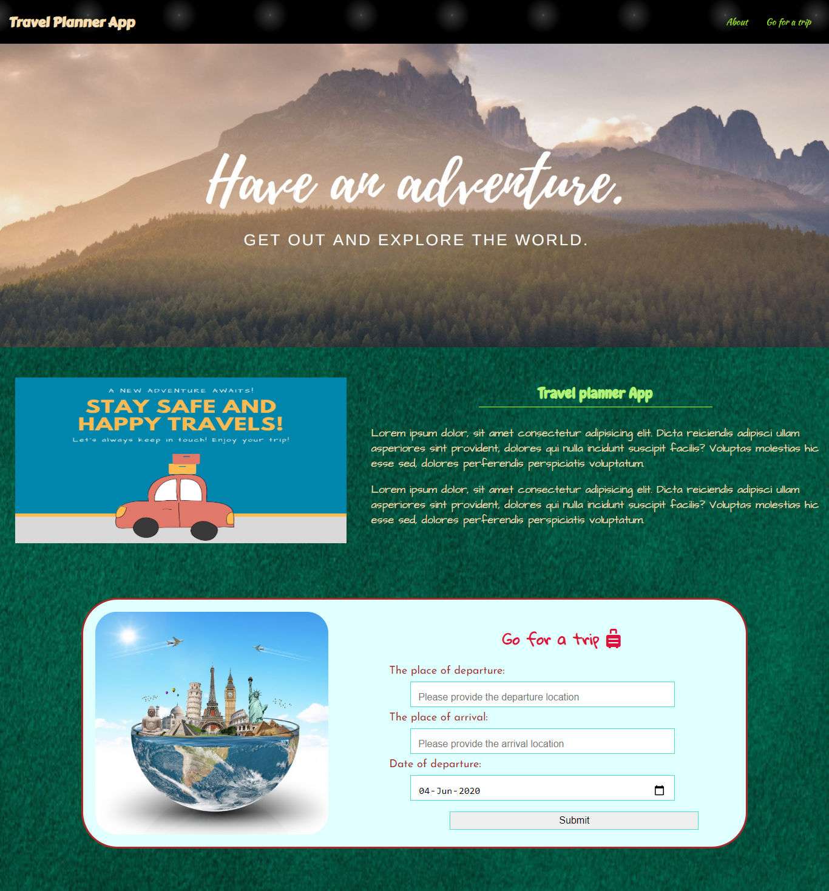
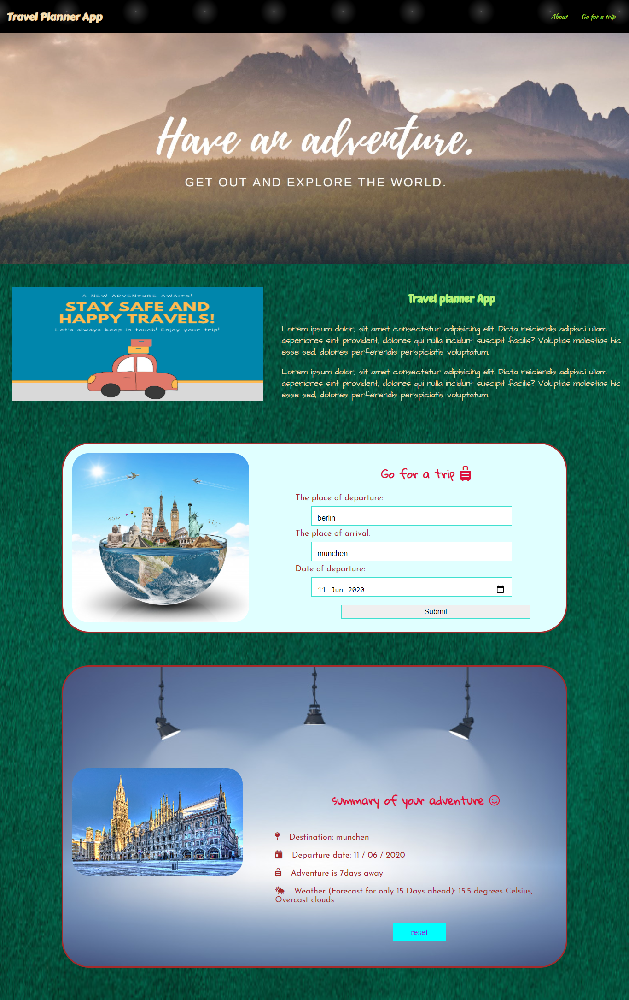

# Travel App

## Project 5 (Capstone) - Travel App (Front End Developer Udacity Nanodegree)

### Created with HTML, CSS, Javascript (Vanilla), Node.js, and webpack

## Project Objective

Buildinng a travel application that contains a simple form which allows the user to give information on upcoming trip (departure location, destination and departure date). With the help of external APIs - Geonames, weatherbit and Pixabay, the app then displays weather and an image of the location on that given date. The forecast weather data can be obtained for only 15 days ahead (Free API membership) .. This is the fiinal project in my Udacity Front-End Development Nanodegree. 

## Project Goals

The goal of this project is to practice with:
- HTML/CSS/JS (client side)
- Node.js (server side)
- Setting up Webpack
- Webpack Loaders and Plugins
- Service workers
- Using APIs and creating requests to external urls

## Getting started

# Install packages and dependecies to produce the node_modules folder
	$npm install

# Add your API keys in the app.js file:
	WeatherbitKey = 'ADD YOUR KEY';
	pixabayAPIKey = 'ADD YOUR KEY';

# Add your geonamesApi username in the app.js file:
	geonamesApiUsername = "ADD YOUR USERNAME";

# Install node.js on your machine and then start express-server at port number: 8000
    $npm start

# Run the app in the dev mode
	$ npm run build-dev
	$ npm run start
	Note:: The web page can be accessed with localhost:8000

# Run the app in the prod mode
	$ npm run build-prod
	$ npm run start
	Note:: The web page can be accessed with localhost:3000

## Configs
The project contains a package.json file, three webpack config files webpack.common.dev.js, webpack.config.dev.js and webpack.config.prod.js for common config, development config and production config respectfully. When the development mode is run, it starts the webpack dev server at port 8000

## Offline Functionality
The project have service workers set up in webpack.

## Testing

# Fire test with Jest and watch tests
    npm test

## Result (input)

## Result (output)

